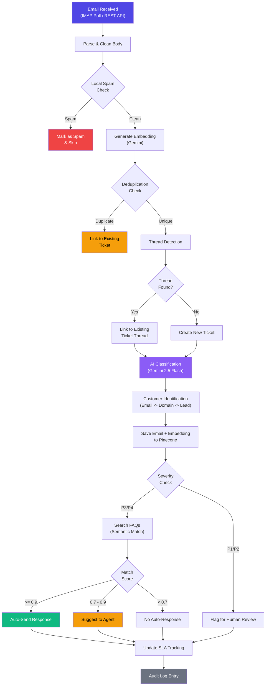

# IntelliDesk AI

**AI-Powered B2B Helpdesk Platform** -- Automated email triage, intelligent ticket management, and smart auto-response generation for enterprise support teams.

IntelliDesk AI ingests customer emails via IMAP or REST API, classifies them using Google Gemini, detects duplicates and threads, identifies customers, creates tickets with SLA tracking, and generates auto-responses from a semantic knowledge base -- all in a single pipeline.

---

## Table of Contents

- [Architecture Overview](#architecture-overview)
- [Email Processing Pipeline](#email-processing-pipeline)
- [Tech Stack](#tech-stack)
- [Features](#features)
- [Project Structure](#project-structure)
- [Database Schema](#database-schema)
- [API Reference](#api-reference)
- [Getting Started](#getting-started)
- [Environment Variables](#environment-variables)
- [Development](#development)
- [License](#license)

---

## Architecture Overview

```
                    +-------------------+
                    |   Gmail / IMAP    |
                    |   REST API POST   |
                    +--------+----------+
                             |
                             v
                 +-----------+-----------+
                 |   Email Processing    |
                 |       Pipeline        |
                 |                       |
                 |  Parse -> Spam Check  |
                 |  Embed -> Dedup      |
                 |  Thread -> Classify   |
                 |  Customer ID -> SLA   |
                 |  Auto-Response        |
                 +-----------+-----------+
                             |
               +-------------+-------------+
               |             |             |
               v             v             v
        +------+---+  +-----+-----+  +----+------+
        | Supabase |  |  Pinecone |  |  Gemini   |
        | Postgres |  |  Vectors  |  |    AI     |
        +----------+  +-----------+  +-----------+
               |             |             |
               v             v             v
        +------+---+  +-----+-----+  +----+------+
        | Tickets  |  | Semantic  |  | Classify  |
        | Accounts |  |  Search   |  | Respond   |
        | SLA etc. |  | Embeddings|  | Summarize |
        +----------+  +-----------+  +-----------+
                             |
                             v
                    +--------+----------+
                    |   Next.js 16 UI   |
                    |   Dashboard       |
                    |   Ticket Mgmt     |
                    |   Knowledge Base  |
                    |   Search          |
                    +-------------------+
```

---

## Email Processing Pipeline



### Pipeline Steps

| Step                 | Module                            | Description                                                                    |
| -------------------- | --------------------------------- | ------------------------------------------------------------------------------ |
| 1. Parse & Clean     | `email/parser.ts`                 | Strip HTML, remove quoted replies, extract signature data                      |
| 2. Spam Detection    | `email/parser.ts`                 | Local keyword-based spam filter (~15 patterns)                                 |
| 3. Embedding         | `gemini/embeddings.ts`            | Generate 3072-dim vector via Gemini Embedding 001                              |
| 4. Deduplication     | `pipeline/deduplicator.ts`        | Message-ID exact match + semantic similarity (threshold 0.85)                  |
| 5. Thread Detection  | `email/thread-detector.ts`        | Header-based (1.0) -> Ticket ref (0.95) -> Fuzzy subject+sender match          |
| 6. AI Classification | `gemini/classify.ts`              | 9-field analysis: category, severity, sentiment, language, confidence, summary |
| 7. Customer ID       | `pipeline/customer-identifier.ts` | Email match -> Domain match -> New lead creation (Bronze tier)                 |
| 8. Auto-Response     | `gemini/respond.ts`               | FAQ semantic search, personalized response, match scoring                      |
| 9. SLA Tracking      | `pipeline/sla-tracker.ts`         | P1-P4 policies, breach detection, alert generation                             |

---

## Tech Stack

| Layer             | Technology                                                                          |
| ----------------- | ----------------------------------------------------------------------------------- |
| **Frontend**      | React 19, TypeScript, Tailwind CSS 4, Lucide Icons                                  |
| **Framework**     | Next.js 16 (App Router, Server Components, Turbopack)                               |
| **Backend**       | Next.js API Routes (RESTful)                                                        |
| **Database**      | Supabase PostgreSQL (11 tables, UUID PKs, auto-incrementing ticket numbers)         |
| **Vector DB**     | Pinecone (3072-dim, cosine metric, 3 namespaces)                                    |
| **AI/ML**         | Google Gemini 2.5 Flash (classification + response), Gemini Embedding 001 (vectors) |
| **Email**         | IMAP polling (ImapFlow), SMTP sending (Nodemailer), mailparser                      |
| **UI Components** | shadcn/ui (19 components), class-variance-authority                                 |
| **Validation**    | Zod                                                                                 |
| **Search**        | Fuse.js (fuzzy matching), Pinecone (semantic)                                       |
| **Dates**         | date-fns                                                                            |

---

## Features

- **Multi-channel email ingestion** -- IMAP polling + REST API (single and bulk)
- **AI-powered classification** -- 9 email categories, 4 severity levels (P1-P4), sentiment analysis, language detection
- **Intelligent thread detection** -- Header-based, ticket reference, and fuzzy subject+sender matching
- **Duplicate detection** -- Exact Message-ID match + semantic similarity via Pinecone vectors
- **Customer enrichment** -- Auto-link to existing accounts, domain matching, automatic lead creation
- **Auto-response generation** -- FAQ-based semantic matching with personalized responses
- **SLA enforcement** -- P1-P4 policies with configurable response/resolution windows, breach alerts
- **Semantic search** -- Vector search across tickets, emails, and FAQs with relevance scoring
- **Audit logging** -- All ticket state changes tracked with timestamps and actor
- **Knowledge base management** -- FAQ CRUD with auto-generated embeddings
- **Dashboard analytics** -- Real-time metrics, SLA alerts, activity feed
- **Ticket management** -- Advanced filtering, sorting, pagination, detail views with thread history

---

## Project Structure

```
intellidesk-ai/
|-- src/
|   |-- app/
|   |   |-- (dashboard)/
|   |   |   |-- page.tsx                 # Main dashboard (metrics, SLA alerts, activity)
|   |   |   |-- layout.tsx              # App layout with sidebar navigation
|   |   |   |-- tickets/
|   |   |   |   |-- page.tsx            # Ticket list (filters, search, pagination)
|   |   |   |   |-- [id]/page.tsx       # Ticket detail (thread, responses, SLA)
|   |   |   |-- emails/page.tsx         # Email inbox view
|   |   |   |-- knowledge-base/page.tsx # FAQ management (CRUD)
|   |   |   |-- search/page.tsx         # Global semantic search
|   |   |   |-- settings/page.tsx       # Configuration
|   |   |-- api/
|   |   |   |-- customers/route.ts      # GET - Account listing
|   |   |   |-- dashboard/route.ts      # GET - Dashboard metrics
|   |   |   |-- emails/
|   |   |   |   |-- ingest/route.ts     # POST - Single email ingestion
|   |   |   |   |-- bulk/route.ts       # POST - Batch email ingestion (up to 50)
|   |   |   |   |-- poll/route.ts       # POST - IMAP inbox polling
|   |   |   |-- faqs/
|   |   |   |   |-- route.ts            # GET/POST - FAQ listing & creation
|   |   |   |   |-- [id]/route.ts       # PUT/DELETE - FAQ update & deletion
|   |   |   |-- respond/route.ts        # POST - Send auto-response email
|   |   |   |-- search/route.ts         # GET - Semantic search
|   |   |   |-- seed/route.ts           # POST - Seed test data / PUT - Re-embed FAQs
|   |   |   |-- tickets/
|   |   |   |   |-- route.ts            # GET - Ticket listing
|   |   |   |   |-- [id]/route.ts       # GET/PATCH - Ticket detail & update
|   |-- components/
|   |   |-- sidebar.tsx                  # Navigation sidebar
|   |   |-- ui/                          # 19 shadcn components
|   |-- lib/
|   |   |-- email/
|   |   |   |-- imap.ts                 # IMAP polling (ImapFlow)
|   |   |   |-- smtp.ts                 # SMTP sending (Nodemailer)
|   |   |   |-- parser.ts              # Email parsing, cleaning, spam detection
|   |   |   |-- thread-detector.ts     # Thread matching (headers + fuzzy)
|   |   |-- gemini/
|   |   |   |-- client.ts              # Gemini AI client (2.5 Flash)
|   |   |   |-- classify.ts            # Email classification (9 fields)
|   |   |   |-- embeddings.ts          # Vector generation (3072-dim)
|   |   |   |-- respond.ts             # Auto-response generation
|   |   |-- pipeline/
|   |   |   |-- processor.ts           # Main pipeline orchestrator
|   |   |   |-- deduplicator.ts        # Duplicate detection
|   |   |   |-- customer-identifier.ts # Customer enrichment
|   |   |   |-- sla-tracker.ts         # SLA monitoring & alerts
|   |   |-- pinecone/
|   |   |   |-- client.ts              # Pinecone vector operations
|   |   |-- supabase/
|   |   |   |-- client.ts              # Client-side Supabase
|   |   |   |-- server.ts              # Server-side Supabase (admin)
|   |-- types/
|   |   |-- index.ts                    # All TypeScript type definitions
|-- supabase/
|   |-- migrations/
|       |-- 001_initial_schema.sql      # Full database schema
|-- package.json
|-- tsconfig.json
|-- next.config.ts
|-- tailwind / postcss configs
```

---

## Database Schema

### Tables

| Table            | Purpose                | Key Fields                                                                    |
| ---------------- | ---------------------- | ----------------------------------------------------------------------------- |
| `accounts`       | Customer organizations | domain, company_name, tier (Gold/Silver/Bronze), csm_name, plan               |
| `contacts`       | Individual users       | account_id, email, name, role, department, is_lead, lead_status               |
| `emails`         | Raw ingested emails    | message_id, from_address, subject, body_text, is_spam, language, embedding_id |
| `tickets`        | Support tickets        | ticket*number (TKT-00001), status, category, severity, ai_confidence, sla*\*  |
| `ticket_emails`  | Ticket-email links     | ticket_id, email_id, relationship (original/reply/forward/duplicate)          |
| `faqs`           | Knowledge base         | question, answer, category, solution_steps, success_rate, embedding_id        |
| `auto_responses` | Generated replies      | ticket_id, response_text, match_type, match_score, cited_faq_ids, sent        |
| `sla_policies`   | SLA definitions        | severity (P1-P4), first_response_minutes, resolution_minutes                  |
| `teams`          | Support teams          | name, category_routing                                                        |
| `audit_logs`     | Change history         | ticket_id, action, details, performed_by                                      |

### SLA Policies

| Severity      | First Response | Resolution |
| ------------- | -------------- | ---------- |
| P1 - Critical | 1 hour         | 4 hours    |
| P2 - High     | 4 hours        | 8 hours    |
| P3 - Medium   | 24 hours       | 72 hours   |
| P4 - Low      | 72 hours       | 7 days     |

### Entity Relationship

```
accounts 1--* contacts
accounts 1--* tickets
contacts 1--* tickets
tickets *--* emails (via ticket_emails)
tickets 1--* auto_responses
tickets 1--* audit_logs
sla_policies -- tickets (severity match)
```

---

## API Reference

### Email Ingestion

| Method | Endpoint             | Description                                                       |
| ------ | -------------------- | ----------------------------------------------------------------- |
| POST   | `/api/emails/ingest` | Ingest a single email (from_address, subject, body_text required) |
| POST   | `/api/emails/bulk`   | Ingest up to 50 emails in batch                                   |
| POST   | `/api/emails/poll`   | Poll IMAP inbox for new unseen emails                             |

### Tickets

| Method | Endpoint            | Description                                                                      |
| ------ | ------------------- | -------------------------------------------------------------------------------- |
| GET    | `/api/tickets`      | List tickets with filters (status, severity, category, search, sort, pagination) |
| GET    | `/api/tickets/[id]` | Get ticket detail with emails, responses, SLA status, similar tickets            |
| PATCH  | `/api/tickets/[id]` | Update ticket (status, severity, category, assigned_team, assigned_agent)        |

### FAQs

| Method | Endpoint         | Description                                    |
| ------ | ---------------- | ---------------------------------------------- |
| GET    | `/api/faqs`      | List FAQs with filtering and search            |
| POST   | `/api/faqs`      | Create FAQ (auto-generates Pinecone embedding) |
| PUT    | `/api/faqs/[id]` | Update FAQ (re-embeds if content changes)      |
| DELETE | `/api/faqs/[id]` | Delete FAQ                                     |

### Other

| Method | Endpoint            | Description                                                                      |
| ------ | ------------------- | -------------------------------------------------------------------------------- |
| GET    | `/api/dashboard`    | Dashboard metrics: ticket stats, email stats, SLA metrics, alerts, activity feed |
| GET    | `/api/customers`    | List accounts with pagination and search                                         |
| POST   | `/api/respond`      | Send auto-response email via SMTP                                                |
| GET    | `/api/search?q=...` | Semantic search across tickets, emails, and FAQs                                 |
| POST   | `/api/seed`         | Seed test data (accounts, contacts, FAQs, tickets)                               |
| PUT    | `/api/seed`         | Re-generate Pinecone embeddings for all FAQs                                     |

---

## Getting Started

### Prerequisites

- Node.js 18+
- A Supabase project (PostgreSQL)
- A Pinecone account (index with 3072 dimensions, cosine metric)
- A Google AI Studio API key (Gemini)
- A Gmail account with an app-specific password (for IMAP/SMTP)

### Installation

```bash
# Clone the repository
git clone https://github.com/shajith240/intellidesk.git
cd intellidesk

# Install dependencies
npm install

# Set up environment variables
cp .env.example .env.local
# Edit .env.local with your credentials (see Environment Variables section)

# Run the database migration
# Copy contents of supabase/migrations/001_initial_schema.sql
# and execute in Supabase SQL Editor

# Seed test data (optional)
# POST to /api/seed after starting the dev server

# Start development server
npm run dev
```

Open [http://localhost:3000](http://localhost:3000) to access the dashboard.

---

## Environment Variables

Create a `.env.local` file in the project root:

```bash
# Supabase
NEXT_PUBLIC_SUPABASE_URL=https://your-project.supabase.co
NEXT_PUBLIC_SUPABASE_ANON_KEY=your-anon-key
SUPABASE_SERVICE_ROLE_KEY=your-service-role-key

# Google Gemini AI
GEMINI_API_KEY=your-gemini-api-key

# Pinecone Vector DB
PINECONE_API_KEY=your-pinecone-api-key
PINECONE_INDEX=intellidesk

# Email - IMAP (Polling)
IMAP_HOST=imap.gmail.com
IMAP_PORT=993
IMAP_USER=your-email@gmail.com
IMAP_PASSWORD=your-app-specific-password

# Email - SMTP (Sending)
SMTP_HOST=smtp.gmail.com
SMTP_PORT=587
SMTP_USER=your-email@gmail.com
SMTP_PASSWORD=your-app-specific-password
```

### Pinecone Index Setup

Create an index in Pinecone with:

- **Name:** `intellidesk`
- **Dimensions:** 3072
- **Metric:** cosine

### Gmail App Password

1. Enable 2-Factor Authentication on your Google account
2. Go to Google Account > Security > App Passwords
3. Generate a password for "Mail" on "Other (IntelliDesk)"
4. Use this password for both IMAP_PASSWORD and SMTP_PASSWORD

---

## Development

```bash
# Development server
npm run dev

# Production build
npm run build

# Start production server
npm start

# Lint
npm run lint
```

### Testing the Pipeline

```bash
# 1. Start the dev server
npm run dev

# 2. Seed test data (accounts, contacts, FAQs)
curl -X POST http://localhost:3000/api/seed

# 3. Re-embed FAQs into Pinecone
curl -X PUT http://localhost:3000/api/seed

# 4. Ingest a test email
curl -X POST http://localhost:3000/api/emails/ingest \
  -H "Content-Type: application/json" \
  -d '{
    "from_address": "user@example.com",
    "subject": "Cannot login to my account",
    "body_text": "I have been trying to login but keep getting an error."
  }'

# 5. Poll IMAP inbox for real emails
curl -X POST http://localhost:3000/api/emails/poll

# 6. Search the knowledge base
curl "http://localhost:3000/api/search?q=password+reset"

# 7. View dashboard metrics
curl http://localhost:3000/api/dashboard
```

---

## License

This project is proprietary software. All rights reserved.
